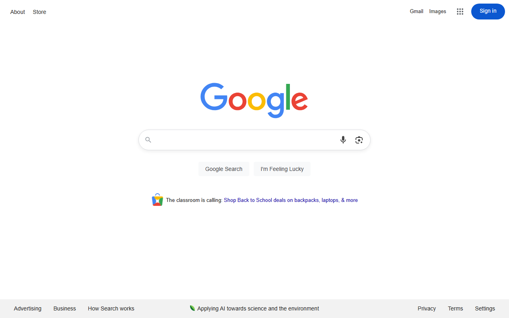
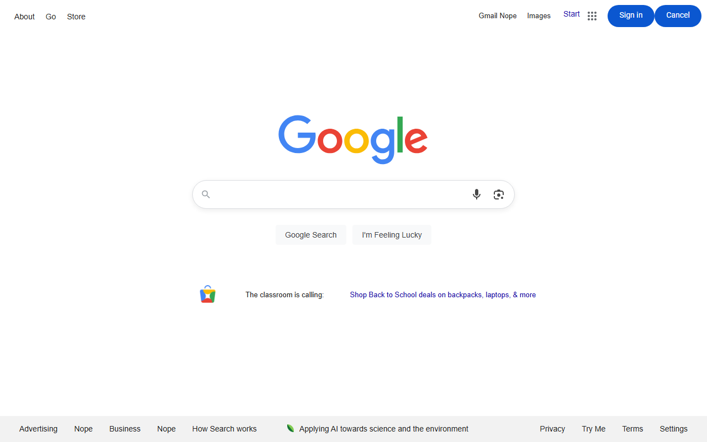
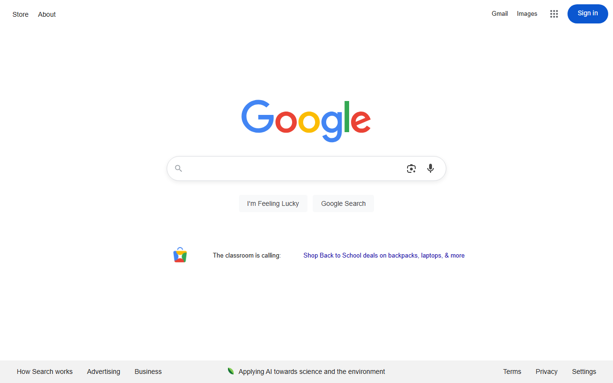

# 🧙 MAGE: Modular HTML Generation Engine

**MAGE** is a framework for generating realistic, diverse, and reusable HTML datasets. It is designed to support research and applications involving GUI navigation, visual grounding, or front-end testing by creating high-quality synthetic web data.

### 🔁 What It Does

MAGE takes raw HTML scraped from real websites and programmatically generates diverse variants by applying two types of mutations:

1. **Distractor Insertion**  
   Adds extra interactive elements (e.g., buttons, links) with misleading or random labels to increase the visual complexity of the interface.

2. **Sibling Shuffling**  
   Randomly reorders adjacent interactive elements (e.g., buttons, inputs) within the same parent container to alter layout structure while preserving content.

These operations help simulate realistic variations in HTML for robustness testing and data augmentation.

### 🧪 Example Mutations
Below are visual examples of HTML mutations performed by the Mutator:

**Original HTML**


---

**Distractor Mutation**—Inserts extra interactive elements (e.g., "Try Me", "Cancel", "Nope") near buttons and links to introduce noise.



---

**Sibling Shuffle Mutation**—Shuffles the order of adjacent interactive elements (e.g., buttons) to vary layout while preserving functionality.



## 📁 Project Structure
- **MAGE/**
  - `main.py` - Entrypoint for scraping HTML and applying mutations
  - `mutator.py` - Applies HTML mutations: distractor insertion and sibling shuffling
  - `top_100_websites.csv` - List of target websites to scrape
  - `data/` - Output folder containing original and mutated HTML files
    - `website1/`
      - `original/` - Unmodified HTML from the website
      - `distractor/` - HTML with added distractor elements
      - `shuffle/` - HTML with shuffled sibling elements

## 🛠️ Setup Instructions

### 1. Install Python dependencies:
```bash
pip install -r requirements.txt
playwright install
```

### 2. Run the mutator:
```bash
python main.py
```
This will:
- Scrape HTML from websites in top_100_websites.csv
- Save original HTML
- Generate and save mutated variants using both mutation types

## 🚀 Use Cases

- GUI navigation research  
- Visual grounding datasets  
- Front-end testing automation  
- HTML layout benchmarking

## 📌 License

This project is released under the **MIT License**.